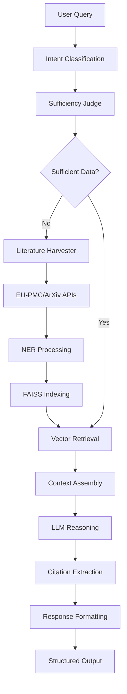

# NanoChemGPT: Domain-Specific RAG for Nanochemistry Literature Mining and Synthesis Planning

[](https://choosealicense.com/licenses/mit/)
[](https://www.python.org/downloads/)
[](https://flask.palletsprojects.com/)
[](https://fastapi.tiangolo.com/)

**NanoChemGPT** is a comprehensive retrieval-augmented generation (RAG) system specifically designed for nanochemistry literature mining, synthesis protocol generation, and mechanistic reasoning. The system combines automated literature harvesting, vector-based retrieval, and large language model reasoning to provide citation-grounded answers and structured synthesis protocols.

## 🔬 Key Features

- **Literature-Grounded RAG**: Retrieval-augmented generation with automatic citation tracking and reference formatting
- **Automated Literature Mining**: EU-PMC and ArXiv harvesting with relevance filtering and NER-based entity extraction
- **Multi-Scale Protocol Generation**: Preserves experimental scales from attachments or defaults to small-scale synthesis
- **Method Transcription**: Intelligent extraction and structuring of experimental procedures from research papers
- **Structured Output**: Converts protocols to robot-executable JSON operations with validation
- **Mechanistic Reasoning**: Domain-specific knowledge base for explaining synthesis pathways and design principles
- **Evaluation Framework**: Comprehensive metrics for span extraction, entity recognition, and protocol structuring
- **Verbatim Mode**: Exact text reproduction from uploaded documents when requested
- **Multiple Vector Stores**: Supports uploads, knowledge base, and mechanistic reasoning contexts

## 🏗️ Architecture Overview



## 📁 Project Structure

```
NanoChemGPT/
├── app.py                    # Main Flask application
├── main_asgi.py             # FastAPI wrapper for production
├── requirements.txt         # Python dependencies
├── env.example             # Environment configuration template
├── ai_eval/                # Evaluation framework
│   ├── assist_runner.py    # Batch evaluation runner
│   ├── grader.py          # Metrics computation
│   ├── configs/           # Evaluation configurations
│   └── datasets/          # Gold standard datasets
├── decider/               # Intent classification and sufficiency
│   ├── intent.py         # Query intent classification
│   ├── judge_sufficiency.py  # Data sufficiency assessment
│   └── miner_queue.py    # Background mining job queue
├── harvester/            # Literature mining pipeline
│   ├── harvester.py     # Main ETL orchestrator
│   ├── config.yaml      # Domain-specific search configurations
│   ├── enhanced_relevance.py  # Multi-dimensional relevance scoring
│   └── miner/           # spaCy NER models and processing
├── retriever/           # Vector search and FAISS integration
│   ├── retriever.py    # Multi-index search interface
│   ├── index_jsonl.py  # JSONL to FAISS indexing
│   └── service.py      # Retriever microservice
├── vector_store/        # Vector storage implementations
├── mech_reasoning/      # Mechanistic knowledge base
├── templates/          # Frontend HTML templates
├── static/            # CSS, JavaScript, and assets
└── scripts/          # Utility and maintenance scripts
```

## 🚀 Quick Start

### Prerequisites

- Python 3.11 or higher
- OpenAI API key (for embeddings and language model)
- MongoDB (optional, for persistent storage)
- 8GB+ RAM (for vector operations)

### Installation

1. **Clone the repository**:
   ```bash
   git clone https://github.com/DMCarnahan/NanoChemGPT.git
   cd NanoChemGPT
   ```

2. **Create virtual environment**:
   ```bash
   python -m venv venv
   source venv/bin/activate  # On Windows: venv\Scripts\activate
   ```

3. **Install dependencies**:
   ```bash
   pip install -r requirements.txt
   ```

4. **Configure environment**:
   ```bash
   cp env.example .env
   # Edit .env with your API keys and configurations
   ```

5. **Run the application**:
   ```bash
   # Development mode
   python app.py

   # Production mode
   uvicorn main_asgi:app --host 0.0.0.0 --port 8000
   ```

6. **Access the interface**:
   Open http://localhost:5000 (development) or http://localhost:8000 (production)

## ⚙️ Configuration

### Environment Variables

| Variable | Description | Default |
|----------|-------------|---------|
| `OPENAI_API_KEY` | OpenAI API key for embeddings and LLM | Required |
| `OPENAI_EMB` | OpenAI embedding model | `text-embedding-3-small` |
| `EMBED_BACKEND` | Embedding backend (`openai` or `st`) | `st` |
| `RETRIEVER_INDEX_DIRS` | Comma-separated FAISS index directories | Auto-detected |
| `SPACY_MODEL` | Path to custom spaCy NER model | `harvester/miner/ner_model/model-best` |
| `ENABLE_ENHANCED_CITATIONS` | Enable context-aware citation filtering | `true` |
| `CITATION_MIN_SCORE` | Minimum relevance score for citations | `0.25` |

### Vector Store Configuration

The system supports multiple vector stores:

- **Uploads**: User-uploaded documents with PDF/text parsing
- **Knowledge Base**: Curated nanochemistry literature corpus
- **Mechanistic KB**: Domain-specific mechanistic reasoning knowledge

Configure index paths in `.env`:
```bash
RETRIEVER_INDEX_DIRS="/path/to/index1,/path/to/index2"
RETRIEVER_INDEX_DIR_DOC="/path/to/document/index"
```

## 📊 Data Pipeline

### Literature Harvesting

The harvester automatically mines literature from multiple sources:

1. **EU-PMC**: European PubMed Central for open access papers
2. **ArXiv**: Preprint server for recent research
3. **Enhanced Relevance**: Multi-dimensional scoring based on:
   - Content relevance to nanochemistry
   - Domain-specific entity density
   - Publication recency and quality
   - Author authority scores

### Processing Pipeline

```bash
# Run literature harvesting
python harvester/harvester.py --config harvester/config.yaml --max-results 200

# Build FAISS indexes
python retriever/index_jsonl.py --input harvester/out_auto/bundle.jsonl --output retriever/index_doc/

# Evaluate system performance
python ai_eval/assist_runner.py --task span --gold ai_eval/datasets/gold_span.jsonl
```

### Data Formats

All datasets use JSONL format for consistency:

```json
{
  "text": "Synthesis of gold nanoparticles via thermal decomposition...",
  "entities": [
    {"label": "MATERIAL", "start": 13, "end": 30, "text": "gold nanoparticles"},
    {"label": "TEMP", "start": 45, "end": 50, "text": "200°C"}
  ],
  "title": "Gold Nanoparticle Synthesis",
  "doi": "10.1021/example.2024.123456"
}
```

## 🔧 API Reference

### Core Endpoints

#### POST `/ask`

Main question-answering endpoint with intelligent routing.

**Request Body**:
```json
{
  "question": "How to synthesize gold nanoparticles?",
  "mode": "protocol",
  "intent": "synthesis",
  "k_doc": 5,
  "k_passage": 10,
  "allow_fetch": true
}
```

**Response**:
```json
{
  "ok": true,
  "answer": "## Gold Nanoparticle Synthesis Protocol\n\n1. Dissolve 0.1 mmol HAuCl₄...",
  "rationale": "The synthesis uses thermal reduction method because...",
  "refs": [
    {"title": "Gold Nanoparticle Synthesis", "url": "https://doi.org/10.1021/example", "authors": "Smith et al."}
  ],
  "usage_markers": ["protocol", "temperature_control"]
}
```

#### POST `/convert`

Convert text protocols to structured robot operations.

**Request Body**:
```json
{
  "text": "Heat the solution to 80°C and stir for 2 hours",
  "target_ops": ["heat", "mix", "wait"]
}
```

**Response**:
```json
{
  "ok": true,
  "operations": [
    {"action": "heat", "target": "solution", "temperature": 80, "unit": "°C"},
    {"action": "mix", "target": "solution", "method": "stir"},
    {"action": "wait", "duration": 2, "unit": "hours"}
  ]
}
```

#### GET `/health`

System health check endpoint.

**Response**:
```json
{
  "status": "ok",
  "timestamp": "2024-01-01T00:00:00Z",
  "version": "1.0.0"
}
```

### Advanced Features

#### Verbatim Mode

Extract exact text from attachments using keywords like "verbatim", "quote", "as written":

```json
{
  "question": "Quote the experimental procedure verbatim",
  "attachments": ["uploaded_paper.pdf"]
}
```

#### Multi-Modal Attachments

Support for PDF, text, and image attachments with automatic content extraction:

```bash
curl -X POST "http://localhost:5000/ask" \
  -F "question=Analyze this synthesis protocol" \
  -F "file=@protocol.pdf"
```

## � Quick Testing

### Basic API Tests

```bash
# Test Q&A functionality
curl -X POST "http://localhost:5000/ask" \
  -H "Content-Type: application/json" \
  -d '{"question": "How do I synthesize gold nanoparticles?"}'

# Test method transcription
curl -X POST "http://localhost:5000/transcribe" \
  -H "Content-Type: application/json" \
  -d '{"text": "Heat 100 mL of HAuCl4 solution to 100°C. Add 10 mL sodium citrate while stirring at 300 rpm for 15 minutes.", "convert_to_robot": true}'
```

### Integration Testing

```bash
# Run comprehensive integration tests
python scripts/test_transcribe_integration.py

# Run full test suite with coverage
pytest tests/ -v --cov=. --cov-report=html
```

## �🧪 Evaluation Framework

### Metrics and Tasks

The `ai_eval` module provides comprehensive evaluation:

| Task | Metric | Description |
|------|--------|-------------|
| `span` | Precision/Recall/F1 | Named entity recognition accuracy |
| `span_attr` | IoU matching | Entity attribute extraction |
| `struct` | Brier score | Protocol structure prediction |
| `bio` | Exact match | Biological entity linking |

### Running Evaluations

```bash
# Span extraction evaluation
python ai_eval/assist_runner.py \
  --task span \
  --gold ai_eval/datasets/gold_span.jsonl \
  --out ai_eval/runs/results.jsonl \
  --spacy-model harvester/miner/ner_model/model-best

# Generate evaluation report
python ai_eval/grader.py --config ai_eval/configs/eval_span.yaml
```

### Custom Evaluation Datasets

Create domain-specific evaluation datasets:

```json
{
  "text": "Heat the gold precursor to 200°C for 1 hour",
  "entities": [
    {"label": "MATERIAL", "start": 10, "end": 23, "text": "gold precursor"},
    {"label": "TEMP", "start": 27, "end": 33, "text": "200°C"},
    {"label": "TIME", "start": 38, "end": 44, "text": "1 hour"}
  ]
}
```

## 🔬 Scientific Applications

### Use Cases

1. **Literature Review**: Automated synthesis protocol extraction from papers
2. **Protocol Optimization**: Scale-aware synthesis planning and validation
3. **Mechanistic Analysis**: Reasoning about synthesis pathways and conditions
4. **Knowledge Discovery**: Finding novel synthesis routes and optimizations
5. **Laboratory Automation**: Converting protocols to robot-executable instructions

### Publication Support

NanoChemGPT supports reproducible research through:

- **Citation Tracking**: Automatic reference extraction and formatting
- **Provenance**: Full traceability from query to source literature
- **Versioning**: Snapshot capability for experimental reproducibility
- **Export Formats**: Support for academic reference managers

## 🧩 Extending the System

### Adding New Data Sources

1. **Create harvester module**:
   ```python
   # harvester/new_source_api.py
   def harvest_new_source(query: str, max_results: int) -> List[Dict]:
       # Implementation
       pass
   ```

2. **Update configuration**:
   ```yaml
   # harvester/config.yaml
   data_sources:
     new_source:
       enabled: true
       api_key: "${NEW_SOURCE_API_KEY}"
       base_url: "https://api.newsource.com"
   ```

3. **Register with main harvester**:
   ```python
   # harvester/harvester.py
   from .new_source_api import harvest_new_source
   ```

### Custom NER Models

Train domain-specific NER models:

```bash
# Prepare training data
python harvester/miner/prepare_training_data.py --input custom_dataset.jsonl

# Train model
python -m spacy train config.cfg --output ./output --paths.train train.spacy --paths.dev dev.spacy

# Update configuration
export SPACY_MODEL=./output/model-best
```

### Adding Evaluation Metrics

```python
# ai_eval/custom_metrics.py
def custom_metric(predictions: List, gold: List) -> float:
    """Implement custom evaluation metric"""
    # Your implementation
    return score
```

## 🤝 Contributing

We welcome contributions! Please see our [Contributing Guidelines](CONTRIBUTING.md) for details.

### Development Setup

1. **Fork the repository**
2. **Create feature branch**: `git checkout -b feature-name`
3. **Install development dependencies**: `pip install -r requirements-dev.txt`
4. **Run tests**: `python -m pytest tests/`
5. **Submit pull request**

### Code Quality Standards

- **Type hints**: All functions must include type annotations
- **Docstrings**: Google-style docstrings for all public methods
- **Testing**: Minimum 80% code coverage
- **Formatting**: Black code formatting with line length 88
- **Linting**: flake8 compliance

## 📚 Citation

If you use NanoChemGPT in your research, please cite:

```bibtex
@software{carnahan2024nanochemgpt,
  author = {Carnahan, D. Michael},
  title = {NanoChemGPT: Domain-Specific RAG for Nanochemistry Literature Mining and Synthesis Planning},
  year = {2024},
  publisher = {GitHub},
  url = {https://github.com/DMCarnahan/NanoChemGPT},
  version = {1.0.0}
}
```

## 📄 License

This project is licensed under the MIT License - see the [LICENSE](LICENSE) file for details.

## 🆘 Support

- **Documentation**: [Wiki](https://github.com/DMCarnahan/NanoChemGPT/wiki)
- **Issues**: [GitHub Issues](https://github.com/DMCarnahan/NanoChemGPT/issues)
- **Discussions**: [GitHub Discussions](https://github.com/DMCarnahan/NanoChemGPT/discussions)
- **Email**: dcarnahan@example.com

## 🗺️ Roadmap

- [ ] Multi-language support for international literature
- [ ] Real-time collaboration features
- [ ] Advanced visualization for synthesis pathways
- [ ] Integration with laboratory information systems
- [ ] Machine learning for protocol optimization
- [ ] Extended support for other chemistry domains

---

**NanoChemGPT** - Advancing nanochemistry research through intelligent literature mining and automated synthesis planning.